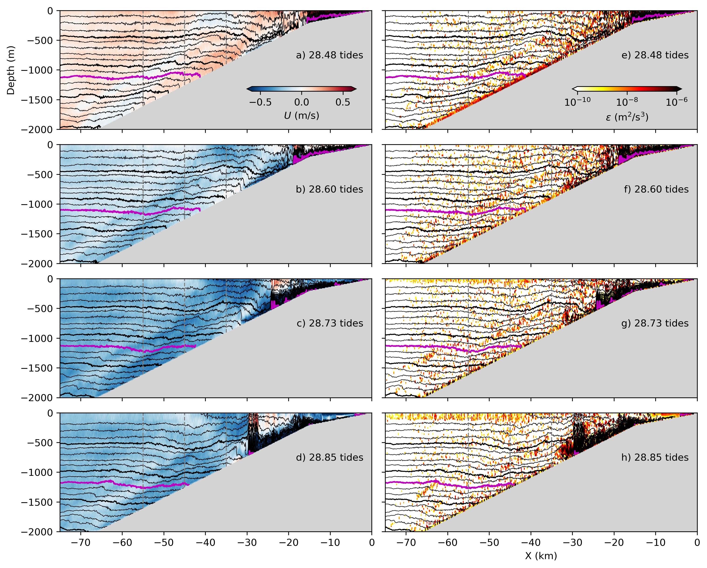

# Summary: Python Script for Figure Generation

## What Was Created

I've converted your `NewLayers.ipynb` notebook into a standalone Python script that generates all the figures and creates markdown snippets for easy documentation.

### Files Created:

1. **`analysis/generate_figures.py`** - Main Python script
   - Fully automated figure generation
   - Takes `runname` and `mooringX` as command-line arguments
   - Generates 7 types of figures for each run
   - Creates markdown snippet with figure captions

2. **`analysis/run_analysis.sh`** - Bash wrapper script (executable)
   - Convenient shorthand for running the analysis
   - Usage: `./run_analysis.sh Slope2D093 "-55 -45 -35"`

3. **`analysis/README_generate_figures.md`** - Complete documentation
   - Usage instructions
   - Examples
   - Troubleshooting guide

## Quick Start

```bash
cd /Users/jklymak/Dropbox/CanyonMix/analysis

# Method 1: Using Python directly
pixi run python generate_figures.py --runname Slope2D093 --mooringX -55 -45 -35

# Method 2: Using the bash wrapper
./run_analysis.sh Slope2D093 "-55 -45 -35"
```

## What the Script Does

### 1. Generates Figures (PNG and PDF)

**Eulerian Analysis:**
- `{runname}_U_eps_snap` - 4 time snapshots of velocity and dissipation
- `{runname}_U_eps_eulerianave` - Tidal-averaged mean fields
- `{runname}_U_eps_timeseries_moorings` - Time series at virtual moorings

**Semi-Lagrangian Analysis:**
- `{runname}_U_eps_layered_snap` - Snapshots in isopycnal coordinates
- `{runname}_U_eps_layered_moorings` - Mooring time series in isopycnal space
- `{runname}_U_eps_layeredave` - Mean sections in isopycnal coordinates
- `{runname}_psi_layered` - Overturning streamfunction

All figures are saved to `analysis/doc/`

### 2. Creates Markdown Snippet

A file `doc/{runname}_figures.md` is created with:
- Properly formatted figure references
- Captions for each figure
- Ready to paste into `writeup/Notes.md`

Example output:
```markdown

```

### 3. Auto-generates Layered Data

If `layered_histograms.nc` doesn't exist for a run, the script automatically:
- Computes semi-Lagrangian (isopycnal) histograms
- Calculates buoyancy fluxes
- Saves the data for future use
- This can take several minutes on first run

## Command-Line Options

```bash
python generate_figures.py --help

Required:
  --runname RUNNAME      Run name (e.g., Slope2D093)
  --mooringX X1 X2 X3    Mooring X locations (e.g., -55 -45 -35)

Optional:
  --skip-layered         Skip semi-Lagrangian analysis
```

## Examples for Different Runs

```bash
# Run 093 (constant stratification)
pixi run python generate_figures.py --runname Slope2D093 --mooringX -55 -45 -35

# Run 091 (variable slope)
pixi run python generate_figures.py --runname Slope2D091 --mooringX -36 -31 -24

# Run 010 (different config)
pixi run python generate_figures.py --runname Slope2D010 --mooringX -36 -31 -24
```

## Workflow Integration

### For a New Model Run:

1. **Generate figures:**
   ```bash
   cd analysis
   pixi run python generate_figures.py --runname Slope2D095 --mooringX -50 -40 -30
   ```

2. **Check output:**
   ```bash
   ls doc/Slope2D095_*.png  # View generated figures
   cat doc/Slope2D095_figures.md  # View markdown
   ```

3. **Add to documentation:**
   ```bash
   # Copy the contents of doc/Slope2D095_figures.md
   # Paste into writeup/Notes.md at the appropriate location
   ```

4. **Generate PDF (if needed):**
   ```bash
   cd ../writeup
   pixi run makenotespdf
   ```

## Key Features

✅ **Batch Processing**: Generate all figures for a run with one command
✅ **Reproducible**: Same input always produces same output
✅ **Documented**: Markdown snippets match your existing documentation style
✅ **Efficient**: Reuses computed layered data across runs
✅ **Non-Interactive**: Runs in background, no GUI needed
✅ **Flexible**: Easy to modify mooring locations per run

## Differences from Notebook

### The Script:
- ✅ Runs non-interactively (no Jupyter required)
- ✅ Takes parameters from command line
- ✅ Automatically saves all figures
- ✅ Generates markdown for documentation
- ✅ Can be integrated into automated workflows
- ✅ Consistent output directory structure

### The Notebook:
- Interactive exploration
- Manual execution cell-by-cell
- Immediate visual feedback
- Good for debugging and development

## Next Steps

if you want to:

**1. Run for a new simulation:**
```bash
cd analysis
pixi run python generate_figures.py --runname YOUR_RUN --mooringX X1 X2 X3
```

**2. Modify the script:**
- Edit `analysis/generate_figures.py`
- Add new figure types
- Adjust plot parameters
- Change output formats

**3. Automate for multiple runs:**
Create a loop script:
```bash
#!/bin/bash
for run in Slope2D091 Slope2D092 Slope2D093; do
    pixi run python generate_figures.py --runname $run --mooringX -55 -45 -35
done
```

**4. Integrate with pixi tasks:**
Add to `pixi.toml`:
```toml
[tasks]
analyze-run = { cmd = "cd analysis && python generate_figures.py --runname ${RUNNAME} --mooringX ${MOORINGS}" }
```

## Troubleshooting

**Script fails with data errors:**
- Verify run data exists in `../results/{runname}/input/`
- Check that required prefixes exist: `spinup`, `dissipation`, `tideave`, `layDiag`

**Out of memory:**
- Close other applications
- Use `--skip-layered` to skip memory-intensive computations

**Figures look different:**
- Verify mooring coordinates match those in notebook
- Check time slices being used (hardcoded in script)
- Compare with notebook output to identify differences

## Notes

- The script uses matplotlib's 'Agg' backend (non-interactive)
- If `jmkfigure` is not available, uses standard matplotlib saving
- Figure generation can take 5-15 minutes per run depending on data size
- Layered histogram computation (first run only) can take several minutes
